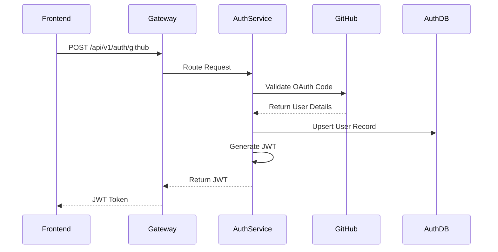

# 🔒 Auth Service

The Auth Service manages all authentication, JWT generation, and OAuth workflows for CoderRide developers.

## 🏗️ Architecture Flow

## 🔑 Key Responsibilities
- **GitHub OAuth Integration**: Validating GitHub authorization codes and fetching developer profiles.
- **JWT Management**: Issuing secure JSON Web Tokens for session management.
- **User Persistence**: Storing core user login credentials in the isolated `auth_db`.
- **Token Validation**: Verifying token signatures for internal requests.

## ⚙️ Environment Variables
Required variables in `.env`:
- `AUTH_DB_URL`
- `AUTH_DB_USERNAME`
- `AUTH_DB_PASSWORD`
- `JWT_SECRET`
- `GITHUB_CLIENT_ID`
- `GITHUB_CLIENT_SECRET`

## 🛠️ Tech Stack
- **Database**: PostgreSQL (`auth_db`)
- **Security**: Spring Security & jjwt
- **Port**: `8081`
